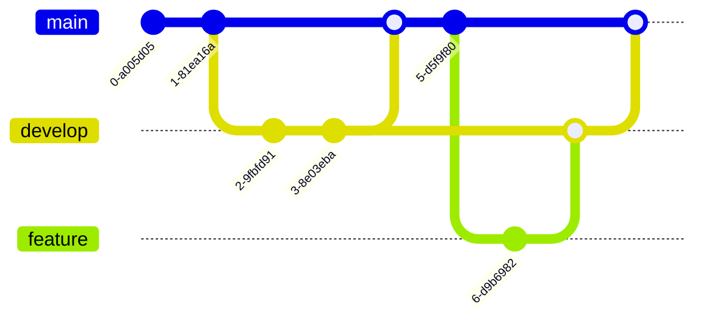

# Mermaid Diagrams Guide

Tens City now supports [Mermaid](https://mermaid.js.org/) diagrams, allowing you to create beautiful visualizations using simple text syntax.

## Flowcharts

Create flowcharts to visualize processes and decision trees:


## Sequence Diagrams

Illustrate interactions between different actors or systems:


## Class Diagrams

Document object-oriented relationships:


## State Diagrams

Model state machines and transitions:


## Gantt Charts

Plan and track project timelines:


## Pie Charts

Visualize proportions and percentages:


## Entity Relationship Diagrams

Model database relationships:


## Git Graphs

Visualize branching and merging:



## Getting Started

To use Mermaid diagrams in your posts, simply use fenced code blocks with the `mermaid` language identifier:

    ```mermaid
    graph LR;
        A-->B;
    ```

The diagram will be automatically rendered when your content is displayed!

## Resources

- [Mermaid Official Documentation](https://mermaid.js.org/)
- [Mermaid Live Editor](https://mermaid.live/) - Test your diagrams
- [Mermaid Cheat Sheet](https://jojozhuang.github.io/tutorial/mermaid-cheat-sheet/)

Happy diagramming! 📊
