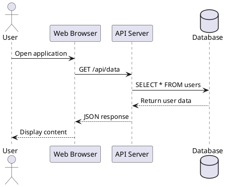
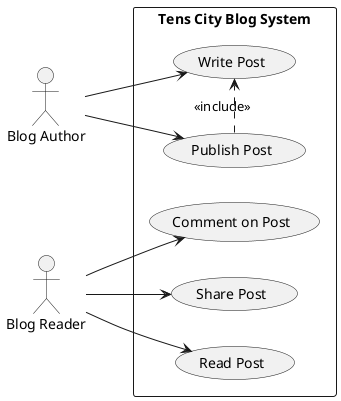
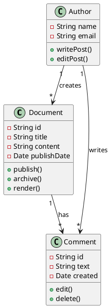
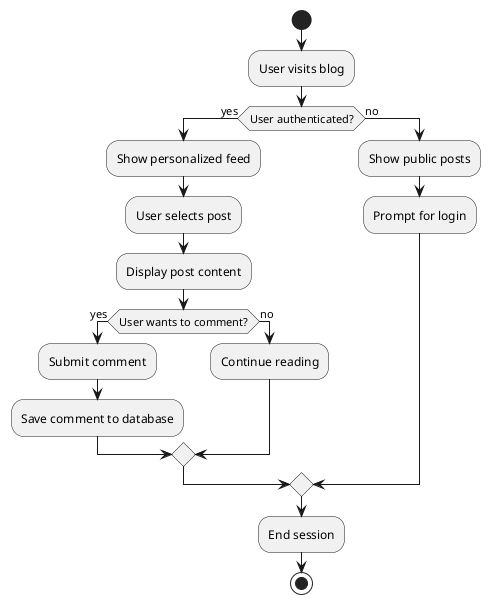
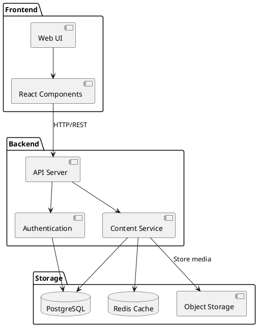
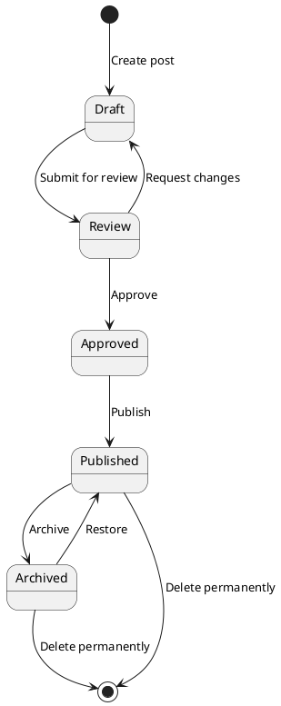
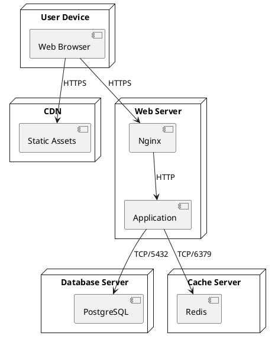
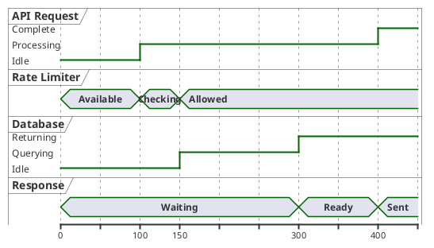
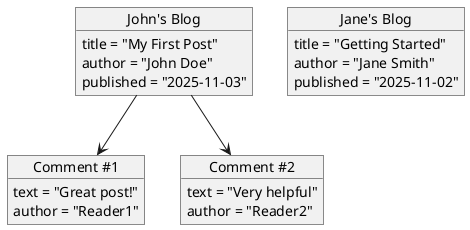

# PlantUML Diagrams Guide

Tens City now supports [PlantUML](https://plantuml.com/) diagrams, enabling you to create professional UML diagrams using simple text descriptions.

## Sequence Diagrams

Model interactions between objects over time:



## Use Case Diagrams

Capture functional requirements:



## Class Diagrams

Model object-oriented structure:



## Activity Diagrams

Model workflows and business processes:



## Component Diagrams

Visualize system architecture:



## State Diagrams

Model object lifecycles:



## Deployment Diagrams

Show physical deployment of artifacts:



## Timing Diagrams

Show timing constraints and interactions:



## Object Diagrams

Show specific instances and relationships:



## Getting Started

To use PlantUML diagrams in your posts, use fenced code blocks with the `plantuml` language identifier and wrap your diagram with `@startuml` and `@enduml`:

    ```plantuml
    @startuml
    Alice -> Bob: Hello
    Bob --> Alice: Hi there!
    @enduml
    ```

The diagram will be automatically rendered as an SVG image!

## Tips

- Start diagrams with `@startuml` and end with `@enduml`
- Use `->` for solid arrows and `-->` for dashed arrows
- Add colors with `#color` syntax (e.g., `#lightblue`)
- Use skinparam to customize appearance
- Keep diagrams simple and focused for best readability

## Resources

- [PlantUML Official Website](https://plantuml.com/)
- [PlantUML Language Reference](https://plantuml.com/guide)
- [Real World PlantUML](https://real-world-plantuml.com/) - Examples gallery
- [PlantUML Online Editor](https://www.planttext.com/)

Happy modeling! 🎨
